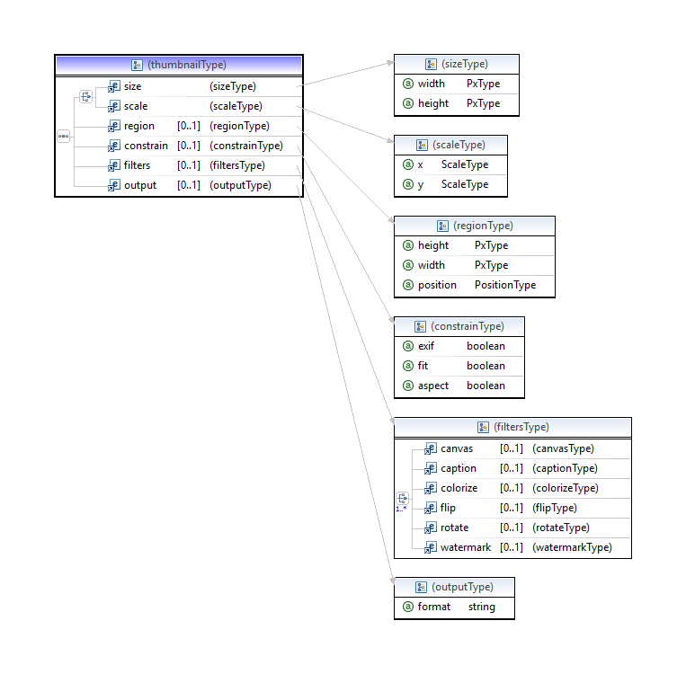
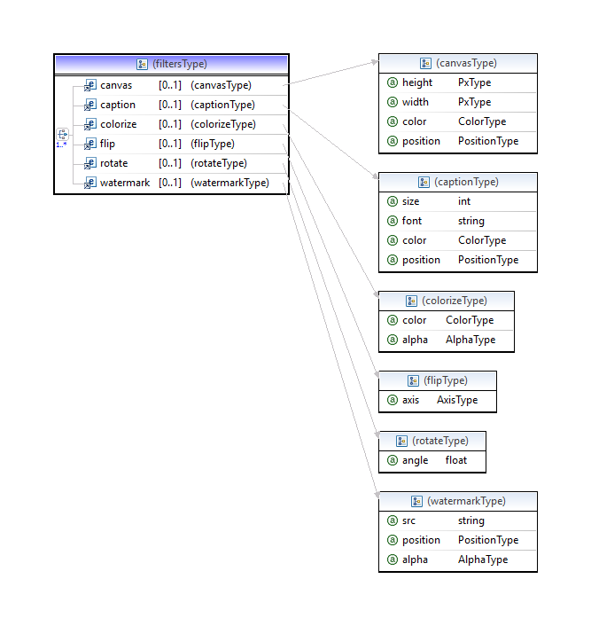

# expkg-zone58:image.thumbnailator

The schema is [task.xsd](../src/main/content/task.xsd)

## thumbnail node



Either `size` or `scale` must be specified. Everything else is optional

`output` can be used to change the output image format.

```
<output format="gif"/>
```

## Filters



## Exif
Image handling is effected by the presence of the 
[exif-orientation](http://www.daveperrett.com/articles/2012/07/28/exif-orientation-handling-is-a-ghetto/) tag.
In particular:
* `size` and `fit` are changed
* the `flip` filter is ignored

To prevent this set constrain @exif=false

```
<constrain exif="false"/>
```
